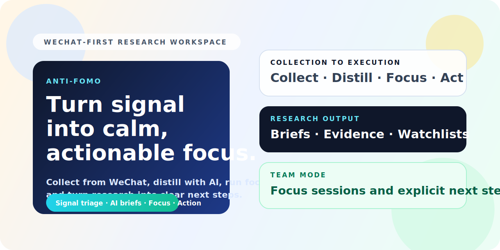

# Anti-FOMO

[English](./README.md) | [简体中文](./README.zh-CN.md)

[](https://nextjs.org/)
[](https://fastapi.tiangolo.com/)
[](./LICENSE)
[](https://github.com/ChrisChen667788/antifomo/stargazers)



Anti-FOMO 是一个开源研究工作台，围绕高信号内容采集、AI 辅助研报、专注会话、行动卡片和面向微信场景的收集流程构建。

如果这个项目对你有帮助，欢迎点一个 star。它会让仓库更容易被发现，也能帮助后续贡献者更快找到它。

先看这里：
- 路线图：[Public roadmap issue](https://github.com/ChrisChen667788/antifomo/issues/1)
- 适合新贡献者的入口：[good first issue](https://github.com/ChrisChen667788/antifomo/issues/2)
- 微信采集可靠性改进：[help wanted issue](https://github.com/ChrisChen667788/antifomo/issues/3)
- 讨论区：[GitHub Discussions](https://github.com/ChrisChen667788/antifomo/discussions)
- 宣发素材包：[docs/open-source-launch-kit.md](./docs/open-source-launch-kit.md)
- 增长文案包：[docs/open-source-growth-copy.md](./docs/open-source-growth-copy.md)
- 公开 backlog：[docs/open-source-backlog.md](./docs/open-source-backlog.md)

## 为什么做 Anti-FOMO

很多信息工具只覆盖这几个层级中的一部分：

- 稍后再读
- 新闻分流
- AI 摘要
- 任务导出

Anti-FOMO 想连接完整回路：

`collect -> filter -> research -> focus -> action`

它的目标不是只让人“看更多内容”，而是把高信号信息真正转成研究、判断和执行。

## 适合谁

- 咨询顾问和策略团队
- 创业者和业务负责人
- BD、市场研究和行业分析团队
- 需要持续盯微信信息流的人
- 想要可本地运行、可改造研究工作台的开发者

## 核心能力

### 1. 高信号采集

- 提交 URL、纯文本和关键词研究请求
- 浏览器扩展快速采集页面
- 多格式采集链路
- 面向微信公众号的 URL-first 采集路径

### 2. 研究工作台

- 生成结构化研报草稿
- 对比多个研究主题
- 跟踪研究版本和 watchlist
- 将研报沉淀成行动卡片

### 3. 专注与执行

- 运行带目标的专注会话
- 自动生成专注会话产物
- 导出后续待办、brief 和阅读清单
- 把研究结果继续桥接到执行流程

### 4. 多端表面

- Web 应用
- FastAPI 后端
- 微信小程序
- Chrome 扩展

## 它和普通信息工具有什么不一样

- `WeChat-first`：不是只面向泛网页链接
- `evidence-aware`：围绕来源质量和研报迭代来设计
- `execution-oriented`：行动卡和会话产物是一等能力
- `hackable`：容易本地运行、检查和二次改造

## 快速开始

### 1. 安装依赖

```bash
npm install
python3 -m venv backend/.venv
source backend/.venv/bin/activate
pip install -r backend/requirements.txt
```

### 2. 配置环境变量

```bash
cp backend/.env.example backend/.env
cp .env.local.example .env.local
```

默认模式使用 mock LLM 行为和本地 SQLite，所以可以在没有外部 API key 的情况下先跑起来。

### 3. 启动后端

```bash
source backend/.venv/bin/activate
uvicorn app.main:app --app-dir backend --reload --host 127.0.0.1 --port 8000
```

### 4. 启动前端

```bash
NEXT_PUBLIC_API_BASE_URL=http://127.0.0.1:8000 npm run dev
```

打开：
- Web：`http://127.0.0.1:3000`
- API：`http://127.0.0.1:8000`

## 仓库结构

```text
.
├── src/                    # Next.js web app
├── backend/                # FastAPI backend, models, services, tests
├── miniapp/                # WeChat mini program
├── browser-extension/      # Chrome extension
├── scripts/                # automation and smoke helpers
└── public/                 # static assets
```

## 项目状态

当前仓库状态：
- 活跃的本地优先原型
- 已完成开源发布脱敏
- Web 构建通过
- 后端测试通过

公开仓库中有意不包含：
- 运行时 `.env`
- 个人数据
- 本地数据库
- `.tmp` 采集日志和截图
- 真实微信小程序 `AppID`

## 配置

### 后端

详见 `backend/.env.example`。

关键分组：
- `DATABASE_URL`：SQLite 或 PostgreSQL
- `LLM_PROVIDER`：`mock` 或 OpenAI-compatible provider
- `OPENAI_*`：主模型配置
- `STRATEGY_OPENAI_*`：可选第二模型配置
- `WORKBUDDY_*`：回调和 webhook 集成

### 小程序

`miniapp/project.config.json` 中的 `appid` 默认是空的。

导入微信开发者工具前：
1. 填入你自己的小程序 `AppID`
2. 把 API 地址改成你的本地或局域网后端

### 浏览器扩展

扩展位于 `browser-extension/chrome`。在 Chrome 开发者模式加载后，把后端地址指向你自己的环境即可。

## 路线图

近期最值得推进的方向：
- 微信采集可靠性进一步增强
- 研报 grounding 和来源可追溯性更强
- watchlist 和实体工作流更顺手
- 专注到行动产物的质量更高
- 更好的公开 demo 资源和演示材料

## 社区

- 想法和产品建议：发 Discussion 或 Feature Request
- Bug：带复现步骤开 Issue
- 代码贡献：见 `CONTRIBUTING.md`
- 安全报告：见 `SECURITY.md`

## 开源宣发素材包

仓库里已经附带一套公开传播可直接用的素材：

- [docs/open-source-launch-kit.md](./docs/open-source-launch-kit.md)
- [docs/open-source-growth-copy.md](./docs/open-source-growth-copy.md)
- [docs/open-source-backlog.md](./docs/open-source-backlog.md)
- [docs/assets/github-hero.svg](./docs/assets/github-hero.svg)
- [docs/assets/github-social-preview.png](./docs/assets/github-social-preview.png)

里面包括：

- GitHub About 文案
- 仓库置顶和个人主页简介文案
- 中英文社媒发布帖草稿
- 面向贡献者的 backlog 入口
- 可直接上传的 social preview 素材

## License

MIT，见 `LICENSE`。
